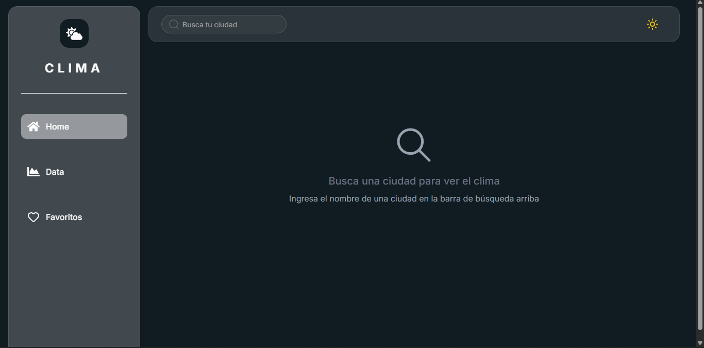
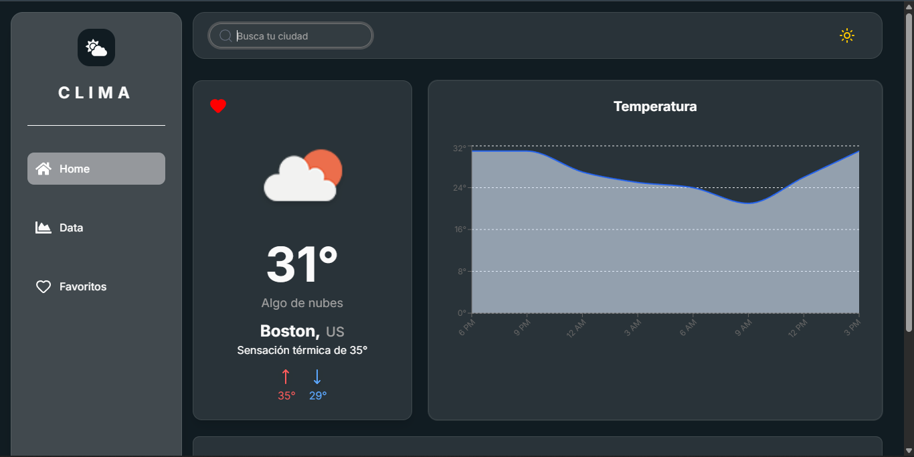
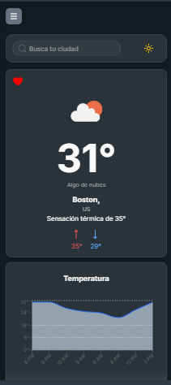

# 🌤️ Weather App

Aplicación web desarrollada con **React**, **TypeScript** y **Tailwind CSS** que permite consultar información meteorológica en tiempo real utilizando la API de OpenWeather.

## 🚀 Características

* Búsqueda de ciudades en tiempo real.
* Consulta de temperatura actual.
* Información sobre humedad, velocidad del viento y condiciones climáticas.
* Interfaz responsive para dispositivos móviles y escritorio.
* Diseño moderno utilizando Tailwind CSS.
* Integración con la API de OpenWeather.

## 🛠️ Tecnologías Utilizadas

* React
* TypeScript
* Tailwind CSS
* Vite
* OpenWeather API
* React Router
* Shadcn
* Sonner

## 📦 Instalación

1. Clona el repositorio:

```bash
git clone https://github.com/tu-usuario/tu-repositorio.git
```

2. Ingresa al directorio del proyecto:

```bash
cd tu-repositorio
```

3. Instala las dependencias:

```bash
npm install
```

4. Crea un archivo `.env` en la raíz del proyecto:

```env
VITE_OPENWEATHER_API_KEY=tu_api_key
```

5. Inicia el servidor de desarrollo:

```bash
npm run dev
```

La aplicación estará disponible en:

```text
http://localhost:5173
```

## 🔑 Variables de Entorno

| Variable                 | Descripción                           |
| ------------------------ | ------------------------------------- |
| VITE_OPENWEATHER_API_KEY | API Key proporcionada por OpenWeather |

## 📸 Capturas

### Página principal



### Búsqueda de ciudad



### Vista móvil




## 📁 Estructura del Proyecto

```text
src/
├── components/
├── context/
├── hook/
├── lib/
├── pages/
├── routes/
├── types/
├── index.css/
├── main.tsx
└── WeatherApp.tsx
```

## 🌐 API Utilizada

La aplicación consume datos meteorológicos de OpenWeather:

https://openweathermap.org/api

## 📱 Responsive Design

La interfaz está optimizada para:

* 📱 Dispositivos móviles
* 💻 Tablets
* 🖥️ Escritorio


## 👨‍💻 Autor

Desarrollado por Raúl.
